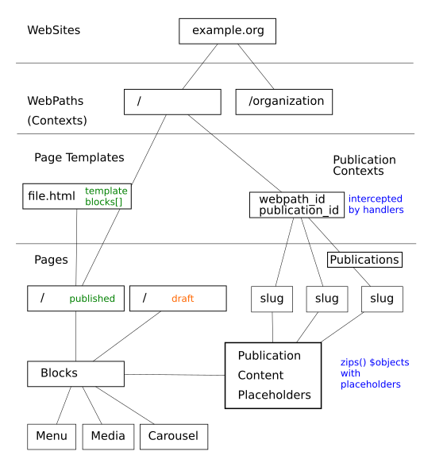
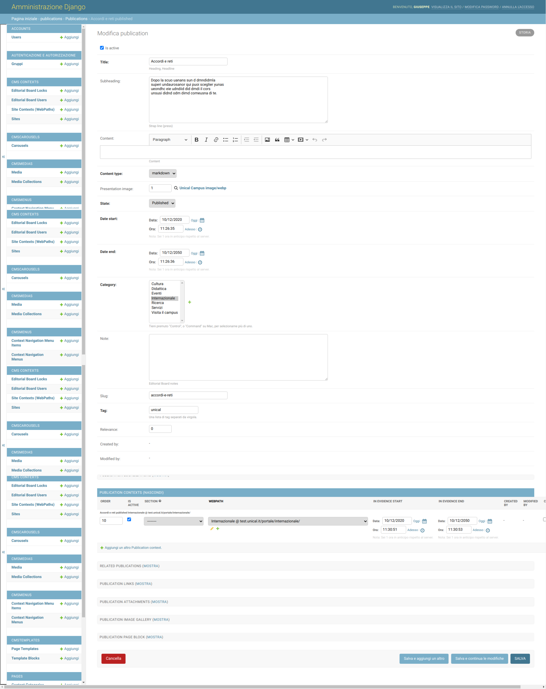
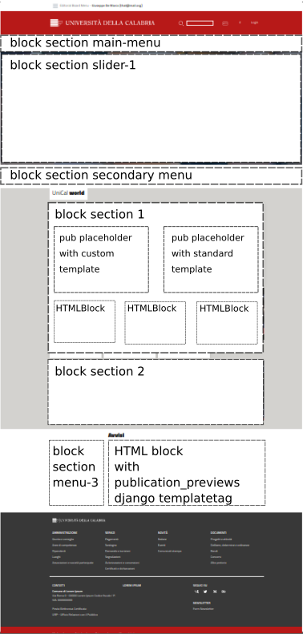

How it works
------------

This section describes which entities and relations composes uniCMS and the handling of HTTP Requests.

HTTP Requests
*************

HTTP Requests are handled by the native Django view which is **cms.contexts.views.cms_dispatch**.
It will:

1. check if a website exists
2. check if **request.get_full_path()** matches one of the Handlers loaded in **settings.py**. 
    - If Yes -> return **handler.as_view()**
    - Else: continue
3. check if **request.get_full_path()** matches a published page
    - If Yes -> return **render(request, page.base_template.template_file, context)**
    - Else: `raise 404()`

WebPaths
********

[WiP]

This section describes how WebPath works and how it can be configured.

- path value match
- child path behavior
- the role of **.get_full_path()**
- some use cases and strategies: third-party url, webpath aliases, intheritance by webpath childs

NavigationBars and Menus
************************

[WiP]

This section describes how to build a Menu.

- Menu object
- MenuItem objects
- How a MenuItem can inherit contents from a publication
- Render an Interactive Menu in a HTML template, reference to uniCMS's' Teamplates documentation

Publications and Handlers
*************************

Publications or Posts are something that are added daily by an Editorial Board.

It would publish some news about a specific topic, as it would be similar to a simple/standard Web Blog aimed to perform some additional instructions as below:

- standard or custom template to represent a pubblication on the screen
- breadcrumbs manager that represent a human readable, interactive, webpath
- page with a list of all the posts, also filtered by category

If the concept of publication or post is clear to all audiences who have at least once published/posted in a WebBlog, a small extra effort is required to understand the fact that uniCMS enable us to:

- create a post and decide in which context (WebPath) to be published, in a single or multiple locations (Contexts)
- manage a block, called *publication_preview* for example, that represents a fancy list of all the publications that belongs to that specific webpath

Handlers will show the history of your Publications (**List**) and will let the user browse them (**View**).

Pages, Blocks and Placeholders
******************************************************

Pages inherit Template Pages to be used as base html template file and optionally a bunch of template blocks. Blocks can be of different type, like the basic one called HTMLBlock which is a Text Field that takes  a raw html with django's template statements. This means that in a HTMLBlock we can load template tags and use Django Template filters and statements, as outlined in the Official Django Documentation.

Furthermore, there are specific blocks other than HTMLBlock with django *templatetags* as content. See Example below:

.. code-block:: html

    
    

        

            

                <h3>Unical world</h3>
            

        

    

    

        

            
        

        

            
        

    

A Page Template HTML file would be splitt into several sections, each of them where a Django templatetag called **load_blocks** will fill the contents. See below Example:

.. code-block:: html

    <!-- Breadcrumbs -->
    
        
    
    <!-- end Breadcrumbs -->

Placeholders are different type of blocks. We have, for instance, **PublicationPlaceholderBlock** which is a block that will be filled by relative publication to the page it belongs to. Let's suppose to distribute 4 publication placeholders in a page and we link them to the same page. As a result we'll have each publication rendered in the Handler Block in orderly fashion  and their positionings (section).

+------------+-----------------+------------------------------+
| index      | block type      | publication                  |
+============+=================+==============================+
| 0          | pub placeholder | the first ordered by "order" |
+------------+-----------------+------------------------------+
| 1          | pub placeholder | the second ordered by "order"| 
+------------+-----------------+------------------------------+
| 2          | pub placeholder | the third ordered by "order" |
+------------+-----------------+------------------------------+

A PublicationPlaceHolder would take also a specific template to allow users to integrate their own styles, ways of representations of the contents given the publication.  For example a template that takes a publication object in input will decide how and what to render: 
the title, subheading, main body content, related objects and so on...

The first placeholder will render the first content following the second one in sequence and so on. This model allows single page template designer to arrange placeholders 
without worrying about the representation of the content. The page that will inherit the uniCMS template will define which publications to import, which web links to handle and so on. Take as simple example the management of the Home Page, where each content is selectively chosen by publishers.

A page can have the following child elements:

- PAGE NAVIGATION BARS 
- PAGE CAROUSELS
- PAGE BLOCKS, extends or disable those inherited from the Page Template
- PUBLICATION CONTENTS
- RELATED PAGES
- RELATED LINKS

This is a simplified page divided by sections that would show how the contents can be distribuited in a Page Template.

