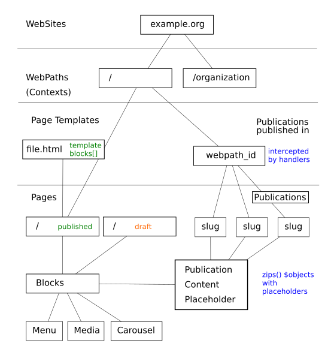
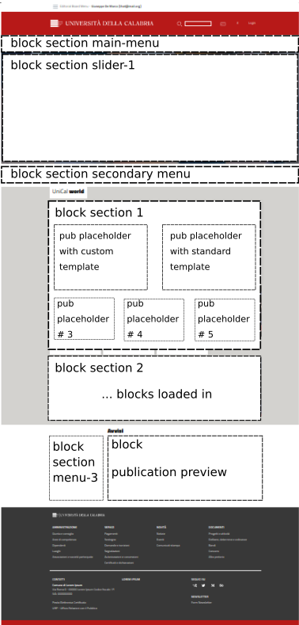

How it works
------------

This section describes which entities and relations composes uniCMS and 
how these latter handles the HTTP Requests.

HTTP Requests
*************

1. http requests are handled by **cms.contexts.views.cms_dispatch**
2. check if website exists
3. check if **request.get_full_path()** matches on of the Handlers loaded in **settings.py**. 
    - If Yes -> return **handler.as_view()**
    - Else: continue
4. check if **request.get_full_path()** matches to a published page
    - If Yes -> return **render(request, page.base_template.template_file, context)**
    - Else: `raise 404()`

Publications and Handlers
*************************

Publications or Posts are something that are added daily by an Editorial Board.
We would publish some news about a specific topic and we want each of following things as well:

- create a menu item that links to a specific post
- have a custom or a personalized template to show a pubblication
- have a breadcrumbs manager that represent a human readable, interactive, webpath
- have a page with a list of all the posts, and also filtered by category

If the concept of publication or post is clear to all those who have 
published at least once in their life in a WebBlog, an extra effort is 
to understand the fact that uniCMS allows us to:

- create a post and decide in which context (webpath) it would be published, one or many
- manage a block, called publication_preview for example, that represent 
  an automatic preview of all the publications that belongs to that webpath

Handlers will show the history of your Publications (**List**) and will 
let the user read them (**View**).

Pages, Blocks and Placeholders
******************************************************

Pages inherit Template Pages, these latter have a base html template file and 
a bunch of template blocks. Blocks can be of different kind, like the 
simplest one, called HTMLBlock that's a Text Field that takes 
a raw html with django's template statements as well. This means that in a HTMLBlock we can load 
template tags and use Django Template filters and statements.

Furthermore, there are specialized blocks which are none other than 
HTMLBlock which load django *templatetags* within their content. Example:

.. code-block:: html

    
    

        

            

                <h3>Unical world</h3>
            

        

    

    

        

            
        

        

            
        

    

A Page Template would be subdivided in section each of them where a Django 
templatetag called **load_blocks** will fill contents. Example:

.. code-block:: html

    <!-- Breadcrumbs -->
    
        
    
    <!-- end Breadcrumbs -->

Placeholders are a different kind of blocks, each one for many kind of applications.
We have, for example, **PublicationPlaceholderBlock** that's a block that will be filled 
by related publication to a page. Let's suppose to distribute 
four publication placeholder in a page, 
and then we configure 4 publication to belong to the same page. Then we'll have
that each publication will be rendered in the Handler Blocks in this way:

+------------+-----------------+------------------------------+
| index      | block type      | publication                  |
+============+=================+==============================+
| 0          | pub placeholder | the first ordered by "order" |
+------------+-----------------+------------------------------+
| 1          | pub placeholder | the second ordered by "order"| 
+------------+-----------------+------------------------------+
| 2          | pub placeholder | the third ordered by "order" |
+------------+-----------------+------------------------------+

This means that the placeholder space will be filled by the publications 
related to a page, according to its ordering, the first placeholder 
will render the first content, the second the second and so on. 
This approach allows a one-page template designer to arrange placeholders 
without worrying about what content will be represented there. 
The page that will inherit this uniCMS template will then define which 
publications to import, think about the management of a 
Home Page, where each content is selectively chosen.

A page can have the following childs elements:

- PAGE NAVIGATION BARS 
- PAGE CAROUSEL 
- PAGE BLOCK, that extends or disable which inherited from its page template
- PUBLICATION CONTENTS

This is a simplified page subdivided by sections that would show to us 
how the contents can be distribuited in a Page Template.

