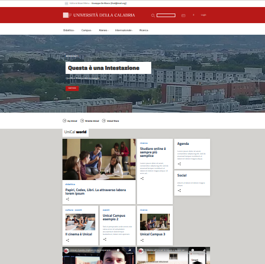

.. uniCMS documentation master file, created by
   sphinx-quickstart on Sat Dec 19 15:42:17 2020.
   You can adapt this file completely to your liking, but it should at least
   contain the root `toctree` directive.

Welcome to uniCMS's documentation!
==================================

This project aims to exemplify the design of a common University Web Portal.
You'll find a simplified generalization of all
the entities that usually make up a Content Management System (CMS).

This platform was built on top of Django Framework, with few specialized libraries as well.
The final goal is to achieve as much as possible, writing as 
little code as possible and working even less, when possibile.

.. toctree::
   :maxdepth: 2
   :caption: Introduction

   contents/introduction.md
   contents/description.md
   
.. toctree::
   :maxdepth: 2
   :caption: Installation and Configuration:

   contents/setup.md

.. toctree::
   :maxdepth: 2
   :caption: Usage

   contents/usage.md

.. toctree::
   :maxdepth: 2
   :caption: Developer task:

   contents/developer.md

Indices and tables
==================

* :ref:`genindex`
* :ref:`modindex`
* :ref:`search`
